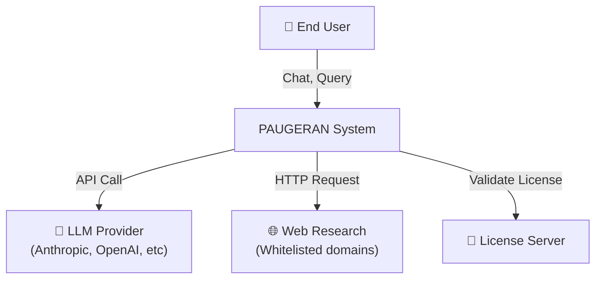
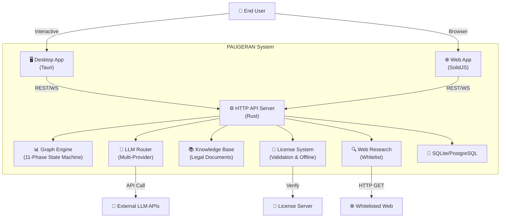
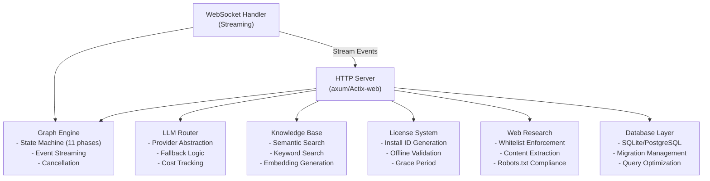
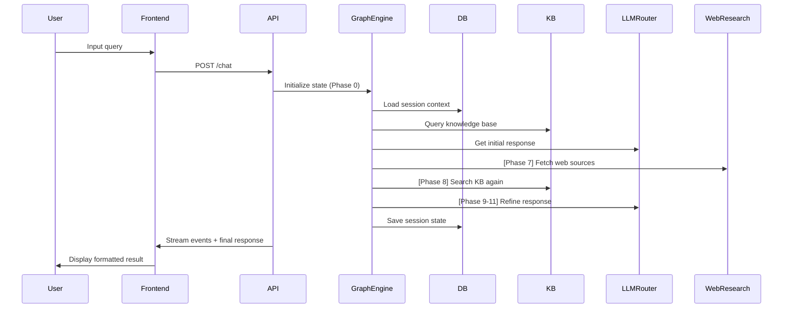
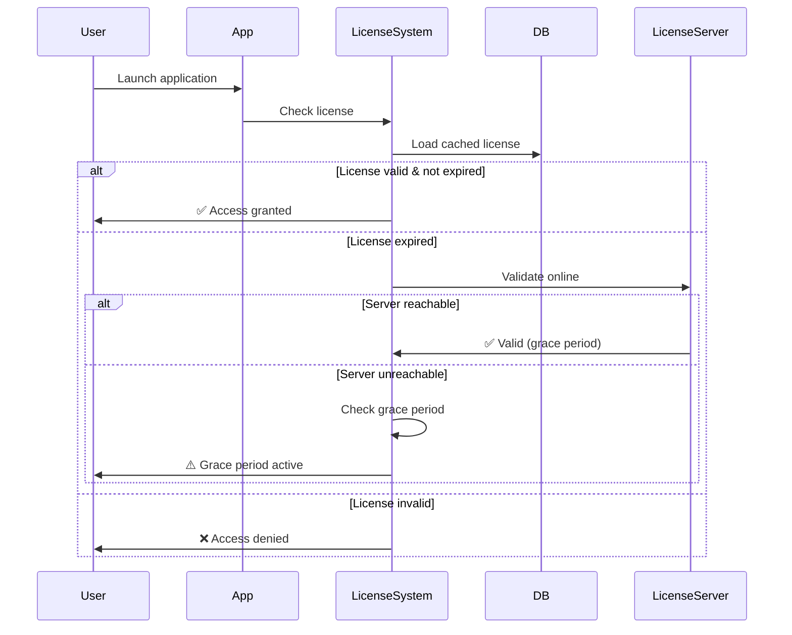
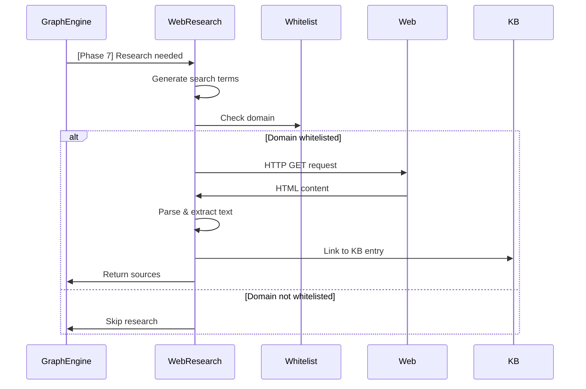

# SPEC-ARCH — Spesifikasi Arsitektur Teknis

Menjelaskan arsitektur sistem secara detail untuk developer.

## Referensi CB
- [CB §6] — Arsitektur sistem
- [CB §7] — Lapisan teknis

---

## Diagram Arsitektur Keseluruhan (C4 Model)

### Context Diagram



### Container Diagram



### Component Diagram (Backend)



---

## Lapisan Teknis

### 1. Presentation Layer (Frontend)
- **Teknologi:** SolidJS, TypeScript
- **Platforms:** Web (browser), Desktop (Tauri)
- **Komponen Utama:**
  - Chat Interface
  - Settings Panel
  - Knowledge Base Manager
  - Export Dialog
  - Accessibility Features

### 2. API Layer (HTTP Server)
- **Teknologi:** Rust (axum atau Actix-web)
- **Endpoints:**
  - `POST /api/v1/chat` — Start chat session
  - `WS /api/v1/chat/{session_id}` — Stream responses
  - `POST /api/v1/export` — Generate document
  - `GET /api/v1/license/validate` — Validate license
  - `GET /api/v1/knowledge-base/search` — Search KB
  - Admin endpoints (jika AUTH_ENABLED)

### 3. Application Logic Layer
- **Graph Engine:** Orchestrate 11-phase workflow
- **LLM Router:** Manage multi-provider LLM access
- **Knowledge Base:** Manage legal documents
- **License System:** Validate licenses
- **Web Research:** Fetch and parse web content

### 4. Data Access Layer
- **Database:** SQLite (local), PostgreSQL (server)
- **ORM/Query Builder:** sqlx, diesel, atau manual SQL
- **Cache Layer:** Optional (Redis untuk performance)

### 5. External Integrations
- **LLM Providers:** Anthropic Claude, OpenAI, OpenAI-compatible, Ollama
- **Web Scraping:** Custom HTTP client
- **License Server:** Custom protocol

---

## Alur Data untuk Setiap Fitur Utama

### Chat dengan Graph Engine



### Validasi Lisensi



### Web Research Flow



---

## Spesifikasi 11-Fase Graph Engine

| Phase | Name | Input | Process | Output | Target Duration |
|-------|------|-------|---------|--------|-----------------|
| 0 | Initialization | User query | Load context, init state | Session state | < 500ms |
| 1 | Query Understanding | Query | Classify intent | Intent, keywords | < 1s |
| 2 | Context Retrieval | Intent | Query KB | Relevant docs | < 2s |
| 3 | Initial Response | Context | Call LLM | Draft response | < 15s |
| 4 | Citation Generation | Draft response | Extract sources | Citations | < 2s |
| 5 | Validation | Citations | Verify with KB | Valid citations | < 3s |
| 6 | Hallucination Check | Response | Compare with KB | Confidence score | < 2s |
| 7 | Web Research | Confidence low | Fetch web sources | Web sources | < 10s |
| 8 | Knowledge Update | Web sources | Update KB entries | Updated entries | < 3s |
| 9 | Refinement | All sources | Call LLM again | Refined response | < 15s |
| 10 | Final Validation | Final response | Check consistency | Validation report | < 2s |
| 11 | Completion | Validation report | Format output | Final result + metadata | < 1s |

---

## Error Handling & Recovery

### Error Types
- **Network Errors:** LLM API unreachable, web research failed
- **Data Errors:** Invalid license, corrupted KB entry, malformed response
- **State Errors:** Session timeout, incomplete state machine
- **Permission Errors:** API key invalid, rate limit exceeded

### Recovery Strategy
```
Error detected
  ├─ Retrieve-able? (e.g., retry LLM call)
  │   ├─ Yes → Retry with exponential backoff
  │   └─ Max retries exceeded → Fallback
  ├─ Fallback? (e.g., use cached response)
  │   ├─ Yes → Return fallback
  │   └─ No → Propagate error
  └─ User-facing error message
```

---

## Event Streaming Protocol

### WebSocket Events

```json
{
  "type": "phase_start",
  "session_id": "uuid",
  "phase": 1,
  "timestamp": "2026-08-29T10:30:00Z"
}
```

```json
{
  "type": "llm_response_chunk",
  "session_id": "uuid",
  "content": "This is a chunk of...",
  "timestamp": "2026-08-29T10:30:02Z"
}
```

```json
{
  "type": "citation_found",
  "session_id": "uuid",
  "source": "UU No. 8 Tahun 2024",
  "section": "Pasal 12",
  "timestamp": "2026-08-29T10:30:05Z"
}
```

---

## Keputusan Arsitektur (ADRs)

### ADR-001: Rust Backend vs. Node.js
**Decision:** Rust
**Rationale:** Performance, memory safety, concurrency, production-readiness
**Trade-offs:** Steeper learning curve, longer compilation time

### ADR-002: SolidJS vs. React
**Decision:** SolidJS
**Rationale:** Reactive by default, smaller bundle, better performance
**Trade-offs:** Smaller ecosystem than React

### ADR-003: SQLite Local vs. PostgreSQL Remote
**Decision:** SQLite for local, PostgreSQL for server
**Rationale:** Flexibility, works offline, scales to servers
**Trade-offs:** Data sync complexity

### ADR-004: WebSocket vs. Server-Sent Events
**Decision:** WebSocket
**Rationale:** Full-duplex, real-time streaming, browser support
**Trade-offs:** More complex than SSE

---

## Trade-off Analysis

### Performance vs. Accuracy
- **High accuracy (many LLM calls, web research):** Slower, higher cost
- **Fast response (fewer calls):** Potential hallucinations
- **Solution:** Configurable via phase strategy

### Local vs. Server Deployment
- **Local (SQLite):** Privacy, offline, no server maintenance
- **Server (PostgreSQL):** Collaboration, backup, analytics
- **Solution:** Support both deployment models

### File Size vs. Features
- **Minimal binary:** Faster download, but limited features
- **Full-featured binary:** Slower download, all features
- **Solution:** Optional web research, modular LLM providers

---

## Performance Requirements

| Metric | Target | Notes |
|--------|--------|-------|
| Chat response time | < 30s | Including LLM latency |
| KB search latency | < 500ms | Semantic + keyword |
| License validation | < 100ms | Cached |
| Export generation | < 5s | PDF/DOCX |
| Concurrent users | 100+ | Local: 10+, Server: 100+ |
| Memory usage | < 500MB | Baseline |
| Startup time | < 2s | Desktop app |

---

## Deployment Models

1. **Standalone Binary** — Desktop app (Tauri) or CLI
2. **Docker Container** — Self-hosted on any Docker host
3. **Railway** — One-click deployment
4. **VPS** — Nginx/Caddy reverse proxy
5. **Homelab** — Tailscale/Cloudflare Tunnel
6. **Air-gapped** — Offline, encrypted, no internet access

---

## Security Considerations

- API keys isolated in environment variables, never in code
- License validation both online and offline
- Session isolation (per-user state machine)
- HTTPS/TLS for all network communication
- Input validation for all user queries
- Rate limiting per API key and IP
- No logging of sensitive content (queries, API responses)

---

## Monitoring & Observability

- **Metrics:** Response time, error rate, concurrent sessions
- **Logs:** Structured JSON logs, aggregated centrally
- **Traces:** OpenTelemetry for distributed tracing
- **Dashboards:** Grafana or similar
- **Alerts:** High error rate, slow response time, resource exhaustion

---

## Checklist Implementasi

- [ ] C4 diagrams finalized
- [ ] 11-phase graph engine specified
- [ ] LLM router interface defined
- [ ] Database schema designed
- [ ] API endpoints defined
- [ ] Error handling strategy documented
- [ ] Performance benchmarks set
- [ ] Deployment models documented
- [ ] Monitoring setup planned

---

## Referensi Tambahan

- [C4 Model](https://c4model.com/)
- [State Machines](https://statecharts.dev/)
- [OpenTelemetry](https://opentelemetry.io/)
