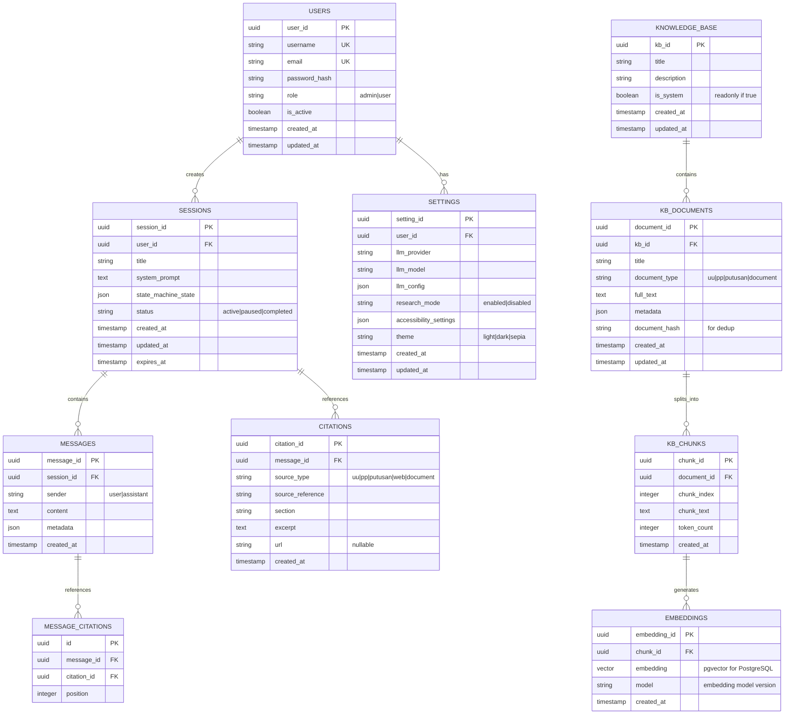

# SPEC-DB — Spesifikasi Database & Migrasi

Skema database yang dapat di-migrate secara deterministik.

## Referensi CB
- [CB §10] — Database requirements dan schema

---

## Database Engines Supported

- **Local Deployment:** SQLite 3.40+
- **Server Deployment:** PostgreSQL 14+
- **Query Builder:** sqlx dengan compile-time checking

---

## Entity Relationship Diagram (ERD)



---

## Migration Files (Sequential)

### 0001_initial.sql
```sql
-- Create users table
CREATE TABLE IF NOT EXISTS users (
    user_id UUID PRIMARY KEY DEFAULT gen_random_uuid(),
    username TEXT UNIQUE NOT NULL,
    email TEXT UNIQUE NOT NULL,
    password_hash TEXT NOT NULL,
    role TEXT DEFAULT 'user' CHECK (role IN ('admin', 'user')),
    is_active BOOLEAN DEFAULT TRUE,
    created_at TIMESTAMP DEFAULT CURRENT_TIMESTAMP,
    updated_at TIMESTAMP DEFAULT CURRENT_TIMESTAMP
);

-- Create sessions table
CREATE TABLE IF NOT EXISTS sessions (
    session_id UUID PRIMARY KEY DEFAULT gen_random_uuid(),
    user_id UUID NOT NULL REFERENCES users(user_id) ON DELETE CASCADE,
    title TEXT NOT NULL,
    system_prompt TEXT,
    state_machine_state JSONB DEFAULT '{}'::jsonb,
    status TEXT DEFAULT 'active' CHECK (status IN ('active', 'paused', 'completed')),
    created_at TIMESTAMP DEFAULT CURRENT_TIMESTAMP,
    updated_at TIMESTAMP DEFAULT CURRENT_TIMESTAMP,
    expires_at TIMESTAMP
);

-- Create messages table
CREATE TABLE IF NOT EXISTS messages (
    message_id UUID PRIMARY KEY DEFAULT gen_random_uuid(),
    session_id UUID NOT NULL REFERENCES sessions(session_id) ON DELETE CASCADE,
    sender TEXT NOT NULL CHECK (sender IN ('user', 'assistant')),
    content TEXT NOT NULL,
    metadata JSONB DEFAULT '{}'::jsonb,
    created_at TIMESTAMP DEFAULT CURRENT_TIMESTAMP
);

-- Create indices for session lookup
CREATE INDEX idx_sessions_user_id ON sessions(user_id);
CREATE INDEX idx_messages_session_id ON messages(session_id);
```

### 0002_add_knowledge_base.sql
```sql
CREATE TABLE IF NOT EXISTS knowledge_base (
    kb_id UUID PRIMARY KEY DEFAULT gen_random_uuid(),
    title TEXT NOT NULL,
    description TEXT,
    is_system BOOLEAN DEFAULT FALSE,
    created_at TIMESTAMP DEFAULT CURRENT_TIMESTAMP,
    updated_at TIMESTAMP DEFAULT CURRENT_TIMESTAMP
);

CREATE TABLE IF NOT EXISTS kb_documents (
    document_id UUID PRIMARY KEY DEFAULT gen_random_uuid(),
    kb_id UUID NOT NULL REFERENCES knowledge_base(kb_id) ON DELETE CASCADE,
    title TEXT NOT NULL,
    document_type TEXT NOT NULL CHECK (document_type IN ('uu', 'pp', 'putusan', 'document')),
    full_text TEXT NOT NULL,
    metadata JSONB DEFAULT '{}'::jsonb,
    document_hash TEXT,
    created_at TIMESTAMP DEFAULT CURRENT_TIMESTAMP,
    updated_at TIMESTAMP DEFAULT CURRENT_TIMESTAMP
);

CREATE UNIQUE INDEX idx_document_hash ON kb_documents(document_hash);
CREATE INDEX idx_kb_documents_kb_id ON kb_documents(kb_id);
```

### 0003_add_citations.sql
```sql
CREATE TABLE IF NOT EXISTS citations (
    citation_id UUID PRIMARY KEY DEFAULT gen_random_uuid(),
    message_id UUID NOT NULL REFERENCES messages(message_id) ON DELETE CASCADE,
    source_type TEXT NOT NULL CHECK (source_type IN ('uu', 'pp', 'putusan', 'web', 'document')),
    source_reference TEXT NOT NULL,
    section TEXT,
    excerpt TEXT,
    url TEXT,
    created_at TIMESTAMP DEFAULT CURRENT_TIMESTAMP
);

CREATE INDEX idx_citations_message_id ON citations(message_id);
```

### 0004_add_embeddings.sql
```sql
-- For PostgreSQL with pgvector extension
CREATE EXTENSION IF NOT EXISTS vector;

CREATE TABLE IF NOT EXISTS kb_chunks (
    chunk_id UUID PRIMARY KEY DEFAULT gen_random_uuid(),
    document_id UUID NOT NULL REFERENCES kb_documents(document_id) ON DELETE CASCADE,
    chunk_index INTEGER NOT NULL,
    chunk_text TEXT NOT NULL,
    token_count INTEGER,
    created_at TIMESTAMP DEFAULT CURRENT_TIMESTAMP
);

CREATE TABLE IF NOT EXISTS embeddings (
    embedding_id UUID PRIMARY KEY DEFAULT gen_random_uuid(),
    chunk_id UUID NOT NULL REFERENCES kb_chunks(chunk_id) ON DELETE CASCADE,
    embedding vector(1536),  -- Anthropic Claude 3 uses 1536 dimensions
    model TEXT DEFAULT 'claude-3-embedding-v1',
    created_at TIMESTAMP DEFAULT CURRENT_TIMESTAMP
);

CREATE INDEX idx_embeddings_chunk_id ON embeddings(chunk_id);
CREATE INDEX idx_embeddings_vector ON embeddings USING ivfflat (embedding vector_cosine_ops);
```

### 0005_add_settings.sql
```sql
CREATE TABLE IF NOT EXISTS user_settings (
    setting_id UUID PRIMARY KEY DEFAULT gen_random_uuid(),
    user_id UUID NOT NULL UNIQUE REFERENCES users(user_id) ON DELETE CASCADE,
    llm_provider TEXT DEFAULT 'anthropic',
    llm_model TEXT DEFAULT 'claude-3-sonnet-20240229',
    llm_config JSONB DEFAULT '{}'::jsonb,
    research_mode TEXT DEFAULT 'enabled' CHECK (research_mode IN ('enabled', 'disabled')),
    accessibility_settings JSONB DEFAULT '{}'::jsonb,
    theme TEXT DEFAULT 'light' CHECK (theme IN ('light', 'dark', 'sepia')),
    created_at TIMESTAMP DEFAULT CURRENT_TIMESTAMP,
    updated_at TIMESTAMP DEFAULT CURRENT_TIMESTAMP
);
```

---

## Index Strategy

| Index | Table | Columns | Reason | Selectivity |
|-------|-------|---------|--------|-------------|
| PRIMARY | users | user_id | Unique identifier | 100% |
| UNIQUE | users | username | User lookup | 100% |
| UNIQUE | users | email | Authentication | 100% |
| FK + WHERE | sessions | user_id | List user's sessions | ~5% |
| FK + WHERE | messages | session_id | List session messages | ~2% |
| UNIQUE | kb_documents | document_hash | Deduplication | 100% |
| FK + WHERE | kb_documents | kb_id | List KB documents | ~1% |
| FK | embeddings | chunk_id | Embedding lookup | 100% |
| VECTOR | embeddings | embedding | Semantic search | Custom |

### Query Performance Notes
- User session list: Use index on (user_id, created_at DESC) for sorting
- Message list: Use index on (session_id, created_at ASC)
- KB search: Use vector index for similarity search + keyword index for exact match

---

## Data Retention Policies

| Table | Retention | Notes |
|-------|-----------|-------|
| users | Indefinite | Except when account deleted |
| sessions | 90 days after completion | Or 180 days from last update |
| messages | Per session retention | Max 2 years per license |
| kb_documents | Indefinite | System KB never deleted |
| embeddings | Sync with kb_chunks | Auto-delete on chunk update |
| citations | Per message retention | Audit trail |

### Cleanup Procedures
```sql
-- Delete completed sessions older than 90 days
DELETE FROM sessions
WHERE status = 'completed'
AND updated_at < CURRENT_TIMESTAMP - INTERVAL '90 days';

-- Cascade delete will remove associated messages, citations
```

---

## Backup & Restore Procedures

### PostgreSQL Backup
```bash
# Full backup
pg_dump -h localhost -U paugeran -d paugeran_db > backup.sql

# Compressed backup
pg_dump -h localhost -U paugeran -d paugeran_db | gzip > backup.sql.gz

# Custom format (faster restore)
pg_dump -h localhost -U paugeran -d paugeran_db -F c > backup.dump
```

### PostgreSQL Restore
```bash
# From SQL file
psql -h localhost -U paugeran -d paugeran_db < backup.sql

# From compressed
gunzip -c backup.sql.gz | psql -h localhost -U paugeran -d paugeran_db

# From custom format
pg_restore -h localhost -U paugeran -d paugeran_db backup.dump
```

### SQLite Backup
```bash
# Simple copy
cp paugeran.db paugeran.db.backup

# Checkpointed backup
sqlite3 paugeran.db ".backup paugeran.db.backup"
```

---

## Rollback Procedures

### Strategy
1. Keep previous migration files (never delete)
2. Create inverse migrations for destructive changes
3. Test rollback in staging before production

### Example Rollback
```sql
-- In migration 0006_rollback_add_column.sql
-- (if adding a column needs to be rolled back)
ALTER TABLE sessions DROP COLUMN IF EXISTS new_column;
```

---

## Performance Tuning

### Query Optimization
- Use `EXPLAIN ANALYZE` for slow queries
- Add LIMIT clauses for browsing queries
- Use pagination for large result sets
- Avoid N+1 queries (use JOIN)

### Connection Pooling
```toml
# Cargo.toml
[dependencies]
sqlx = { version = "0.7", features = ["postgres", "sqlite", "runtime-tokio", "pool"] }
```

```rust
// Connection pool setup
let pool = PgPoolOptions::new()
    .max_connections(5)
    .connect(&database_url)
    .await?;
```

### Batch Operations
```rust
// Batch insert chunks for better performance
sqlx::query(
    "INSERT INTO kb_chunks (document_id, chunk_index, chunk_text, token_count)
     VALUES (?, ?, ?, ?)"
)
.bind(document_id)
.execute_many(&pool)
.await?;
```

---

## Migration Management

### Using sqlx-cli
```bash
# Create new migration
sqlx migrate add -r add_new_column

# Run migrations
sqlx migrate run --database-url $DATABASE_URL

# Revert migration
sqlx migrate revert --database-url $DATABASE_URL
```

### Versioning
- Use semantic versioning: v1.0.0
- Each migration file prefixed with version: `v1_0_1_add_column.sql`

---

## Checklist Implementasi

- [ ] Database engine compatibility tested (SQLite + PostgreSQL)
- [ ] ERD diagram approved
- [ ] All migration files created and tested
- [ ] Index performance benchmarked
- [ ] Backup/restore procedures tested
- [ ] Rollback procedures documented and tested
- [ ] Data retention policies implemented
- [ ] Query performance guidelines established
- [ ] Connection pooling configured

---

## Referensi Tambahan

- [PostgreSQL Documentation](https://www.postgresql.org/docs/)
- [SQLite Documentation](https://www.sqlite.org/docs.html)
- [sqlx-rs Documentation](https://docs.rs/sqlx/)
- [pgvector Extension](https://github.com/pgvector/pgvector)
