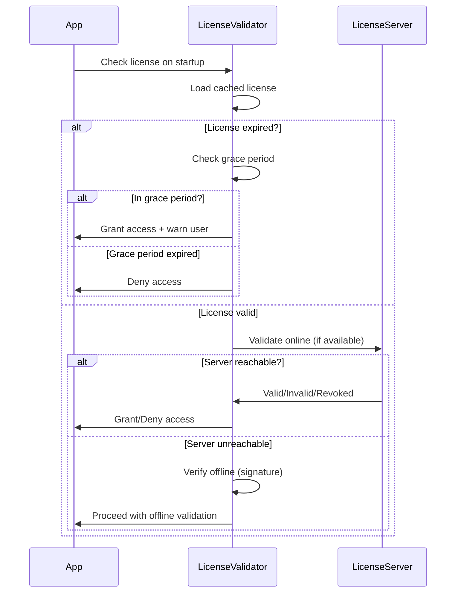

# SPEC-LICENSE — Spesifikasi Sistem Lisensi

Detail implementasi sistem lisensi.

## Referensi CB
- [CB §12] — Licensing system architecture

---

## License Types

| Type | Features | Duration | Price |
|------|----------|----------|-------|
| Trial | Full features | 14 days | Free |
| Personal | All features | 1 year | $199 |
| Team | Multi-seat + collab | 1 year | $99/seat |
| Enterprise | Custom | Custom | Custom |

---

## Installation ID Generation

### Algorithm

```rust
pub struct InstallationIdGenerator {
    machine_id_sources: Vec<MachineIdSource>,
}

enum MachineIdSource {
    MacAddress,
    DiskSerial,
    MotherboardSerial,
    HardwareUUID,
}

impl InstallationIdGenerator {
    pub fn generate() -> Result<String> {
        // Collect machine identifiers
        let machine_id = self.collect_machine_id()?;
        
        // Hash with timestamp
        let mut hasher = Sha256::new();
        hasher.update(&machine_id);
        hasher.update(SystemTime::now()
            .duration_since(UNIX_EPOCH)?
            .as_secs()
            .to_le_bytes());
        
        // Format as UUID
        let hash = hasher.finalize();
        let installation_id = format_as_uuid(&hash)?;
        
        Ok(installation_id)
    }
    
    fn collect_machine_id(&self) -> Result<Vec<u8>> {
        // Try multiple sources for robustness
        for source in &self.machine_id_sources {
            if let Ok(id) = self.get_id_from_source(source) {
                return Ok(id);
            }
        }
        Err("Cannot generate installation ID".into())
    }
}
```

### Result Format
```
Installation ID: A3F2-7B9C-E1D5-42F8-C6A1-9E7D-B3F2-5C8A
```

---

## Grace Period Logic

### Timeline

```
Day 0: License Expires
  ├─ Server reachable?
  │   ├─ Yes → Attempt online validation
  │   └─ No → Enter grace period
  │
Day 0-14: Grace Period (14 days)
  ├─ Full access continues
  ├─ Warn user in UI: "License expired"
  │   └─ Show "Extend license" button
  ├─ Background: Retry validation every 24h
  │   ├─ If valid → Exit grace period
  │   └─ If still expired → Continue
  │
Day 15: Grace Period Expired
  ├─ Block access
  └─ Show license renewal screen
```

### Implementation

```rust
pub struct GracePeriodManager {
    grace_period_days: i32,  // 14
}

impl GracePeriodManager {
    pub fn check_status(&self, license: &License) -> LicenseStatus {
        let now = SystemTime::now();
        let expires_at = license.expires_at;
        
        match now.cmp(&expires_at) {
            Ordering::Less => {
                LicenseStatus::Valid
            }
            Ordering::Equal | Ordering::Greater => {
                let days_expired = now.duration_since(expires_at)
                    .unwrap()
                    .as_secs() / (24 * 3600);
                
                if days_expired <= self.grace_period_days as u64 {
                    LicenseStatus::GracePeriod {
                        days_remaining: self.grace_period_days as i32 - days_expired as i32,
                    }
                } else {
                    LicenseStatus::Expired
                }
            }
        }
    }
}
```

---

## License Offline Format

### Encrypted License File

```json
{
  "version": "1.0",
  "installation_id": "A3F2-7B9C-E1D5-42F8-C6A1-9E7D-B3F2-5C8A",
  "license_key": "PAUGERAN-XXXXXXXX-XXXXXXXX",
  "license_type": "personal",
  "features": ["chat", "export", "web_research", "kb_manage"],
  "activation_date": "2026-01-01T00:00:00Z",
  "expiration_date": "2027-01-01T00:00:00Z",
  "signature": "base64_encoded_signature",
  "metadata": {
    "owner_email": "user@example.com",
    "machine_name": "MacBook Pro",
    "os": "macOS",
    "version": "PAUGERAN v1.0.0"
  }
}
```

**Encryption:**
- Algorithm: AES-256-GCM
- Key derivation: PBKDF2 (installation_id as base)

---

## Cryptographic Signing Mechanism

### Key Pair Management

```rust
pub struct LicenseKeyManager {
    private_key: RsaPrivateKey,  // Server-side only
    public_key: RsaPublicKey,     // Embedded in app
}

impl LicenseKeyManager {
    pub fn sign_license(&self, license: &License) -> Result<String> {
        // Serialize license
        let license_bytes = serde_json::to_vec(license)?;
        
        // Sign with private key
        let signature = self.private_key.sign(
            PaddingScheme::new_pkcs1v15_sign::<Sha256>(),
            &license_bytes,
        )?;
        
        // Return base64-encoded signature
        Ok(base64::encode(&signature))
    }
    
    pub fn verify_license(&self, license: &License, signature: &str) -> Result<bool> {
        let license_bytes = serde_json::to_vec(license)?;
        let signature_bytes = base64::decode(signature)?;
        
        match self.public_key.verify(
            PaddingScheme::new_pkcs1v15_sign::<Sha256>(),
            &license_bytes,
            &signature_bytes,
        ) {
            Ok(()) => Ok(true),
            Err(_) => Ok(false),
        }
    }
}
```

---

## Server-Side License Management

### License Server API

```yaml
POST /api/license/validate:
  Input:
    - installation_id
    - license_key
  Process:
    1. Query license database
    2. Check if valid and not expired
    3. Check grace period
    4. Update last_check timestamp
  Output:
    - valid: boolean
    - type: license_type
    - expires_at: datetime
    - features: [...]
    - grace_period_days: integer

POST /api/license/generate:
  Input:
    - email
    - license_type
    - duration_days
  Process:
    1. Generate license_key
    2. Create license record in DB
    3. Sign with private key
  Output:
    - license_file (JSON + encrypted)
    - activation_link
    
POST /api/license/extend:
  Input:
    - license_key
    - additional_days
    - payment_info
  Process:
    1. Validate payment
    2. Extend expiration_date
    3. Generate new signed license
  Output:
    - new_license_file
    - new_expiration_date
```

---

## Feature Gating

### Feature Flags

```rust
pub enum Feature {
    Chat,
    Export,
    WebResearch,
    KnowledgeBaseManagement,
    TeamCollaboration,
    AdminPanel,
    CustomLlmProvider,
    OfflineLicense,
}

pub struct FeatureGate {
    by_license_type: HashMap<LicenseType, Vec<Feature>>,
}

impl FeatureGate {
    pub fn is_enabled(&self, feature: Feature, license: &License) -> bool {
        self.by_license_type
            .get(&license.license_type)
            .map(|features| features.contains(&feature))
            .unwrap_or(false)
    }
}

// In UI/API
pub async fn export_document(
    req: ExportRequest,
    user: &User,
) -> Result<Document> {
    if !FEATURE_GATE.is_enabled(Feature::Export, &user.license) {
        return Err("Feature not available for your license type".into());
    }
    
    // Continue with export
}
```

---

## Migration Strategy

### Upgrading License

```
Old License (Trial expires 2026-09-15)
    ↓
User clicks "Upgrade to Personal"
    ↓
Payment processed (Stripe)
    ↓
New License Generated:
  - installation_id: same
  - type: personal
  - expires_at: 2027-01-15 (1 year from activation)
    ↓
Old license revoked
    ↓
User downloads new license file
    ↓
App restarts, loads new license
```

### Downgrading License

```
Personal License (with all features)
    ↓
User clicks "Downgrade to Free Trial"
    ↓
Confirmation: "You will lose access to Export, Web Research"
    ↓
New Free Trial license generated
    ↓
Features gracefully disabled:
  - Export button hidden/disabled
  - Web research disabled in graph engine
  - KB management disabled
```

---

## Privacy Considerations

### Data Sent to License Server

✅ **Allowed:**
- installation_id
- license_key
- app_version
- request_timestamp

❌ **NEVER Send:**
- User queries
- Session content
- Document content
- API keys
- LLM provider credentials

### Data Protection

```rust
pub struct LicenseValidator {
    // All validation requests use HTTPS only
    tls_config: TlsClientConfig,
    
    // Timeout to prevent hanging
    timeout: Duration,
    
    // Fallback to offline validation
    offline_cache: OfflineCache,
}

impl LicenseValidator {
    pub async fn validate(
        &self,
        license: &License,
    ) -> Result<ValidationResult> {
        // Try online validation first
        match self.validate_online(license).await {
            Ok(result) => Ok(result),
            Err(_) => {
                // Fall back to offline validation
                self.validate_offline(license)
            }
        }
    }
    
    async fn validate_online(&self, license: &License) -> Result<ValidationResult> {
        let client = reqwest::Client::new();
        let response = client
            .post(&self.server_url)
            .timeout(self.timeout)
            .json(&ValidationRequest {
                installation_id: license.installation_id.clone(),
                license_key: license.license_key.clone(),
            })
            .send()
            .await?;
        
        Ok(response.json().await?)
    }
    
    fn validate_offline(&self, license: &License) -> Result<ValidationResult> {
        // Verify cryptographic signature
        let verified = self.verify_signature(license)?;
        
        // Check expiration
        let expired = license.expires_at < SystemTime::now();
        
        if verified && !expired {
            Ok(ValidationResult::Valid)
        } else {
            Ok(ValidationResult::Invalid)
        }
    }
}
```

---

## License Validation Flow



---

## Checklist Implementasi

- [ ] License types defined
- [ ] Installation ID generation working
- [ ] Grace period logic implemented
- [ ] Offline license format designed
- [ ] Cryptographic signing implemented
- [ ] License server API designed
- [ ] Feature gating system working
- [ ] Migration strategy tested
- [ ] Privacy guidelines followed
- [ ] Validation flow tested end-to-end

---

## Referensi Tambahan

- [RSA Encryption](https://en.wikipedia.org/wiki/RSA_(cryptosystem))
- [PBKDF2](https://en.wikipedia.org/wiki/PBKDF2)
- [License Server Best Practices](https://www.cockos.com/licensekey/)
